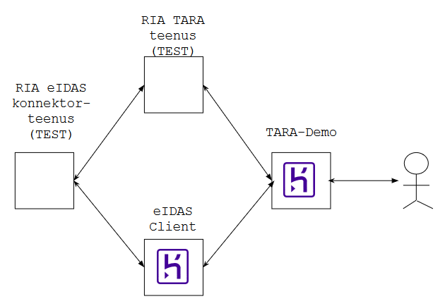

# TARA-Demo

TARA-Demo on klientrakendus, mis demonstreerib kuidas asutuse e-teenust ühendada autentimisteenusega TARA.

Käivitamine: [https://tarademo.herokuapp.com](https://tarademo.herokuapp.com)

Sõltuvalt TARA teenuse ja RIA eIDAS konnektorteenuse seadistusest saab demos kasutada kas reaalseid või testandmeid. Kui teenused on häälestatud kasutama testandmeid, siis tuleb proovimisel kasutada test-ID-kaarte ja [numbreid Mobiil-ID testimiseks](https://www.id.ee/?id=36373).

TARA-Demo on kirjutatud Node.js-s ja majutatud Heroku pilveteenusesse.

Kavas on TARA-Demo ühendada eIDAS-Client abikomponendi abil ka RIA eIDAS konnektorteenusega (vt allolev skeem). Siis hakkab TARA-Demo demonstreerima ka kuidas välismaalase autentimist e-teenuse otseühendumisega RIA eIDAS konnektorteenuse külge.

